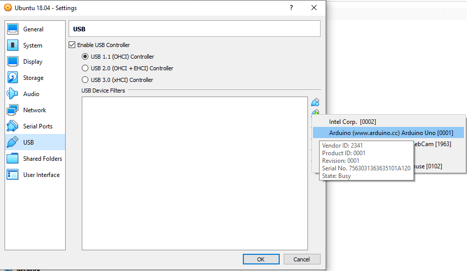
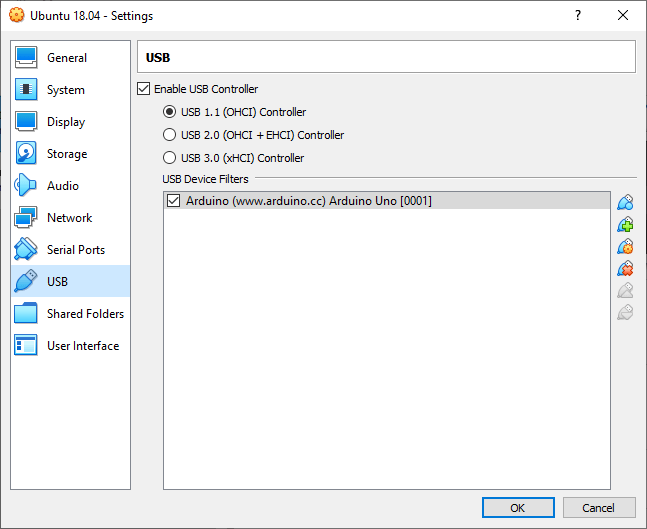
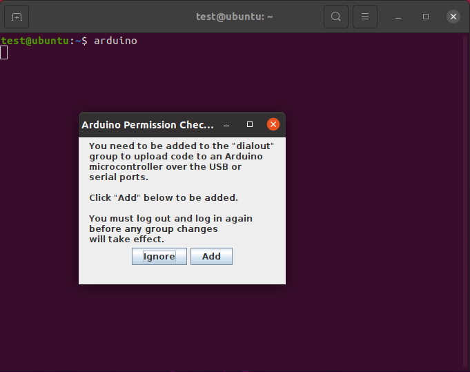

# Installation guide 

## Index
- Connect the Arduino to a Linux machine
	- on a real Linux machine (no Virtual Machine)
	- on a Linux Virtual Machine

- Install Arduino on Linux


### Connect the Arduino on a Linux Virtual Machine
- Connect the device to the PC hosting the Virtual Machine
	- On VirtualBox, open the settings for your Ubuntu virtual machine and go to the USB section. Click on the small USB icon with a “+”. In the list of devices you should see your Arduino board.





- **On VMVare, it's easier : just plug the device to the pc hosting the Virtual Machine when ruinning it and a popup message will appear asking you if you want to connect it to the VM.**


### Install Arduino on Linux
- Launch on a terminal the following command:

```bash
sudo apt install arduino
```

Now that the Arduino IDE is installed, all you have to do to launch it is to open a terminal and execute the following command:

```bash
arduino
```

On the first launch, you’ll get a popup asking you to add yourself to the “dialout” group.



### Control Arduino Boards on Ubuntu using Python and pyFirmata
- load the firmata example : Files > Examples > Firmata > StandardFirmata
- To use this library: 

```arduino
#include <Firmata.h>
```

- Install PyFirmata on Ubuntu
```bash
pip install pyfirmata
```